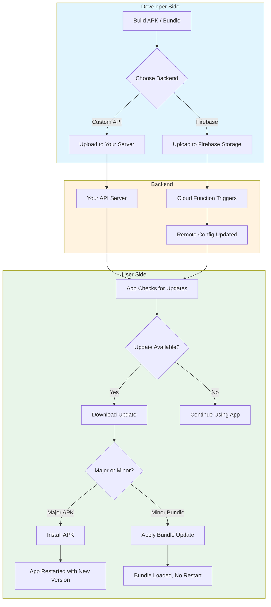
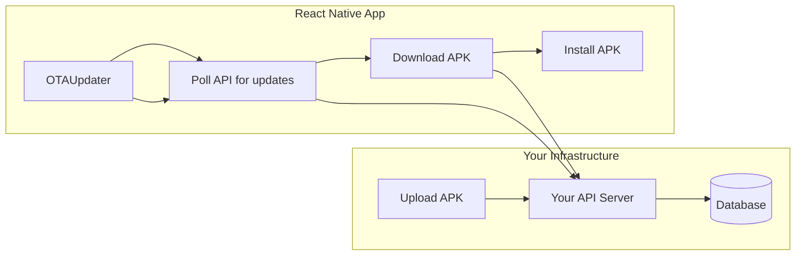
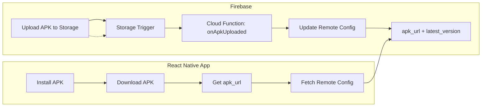
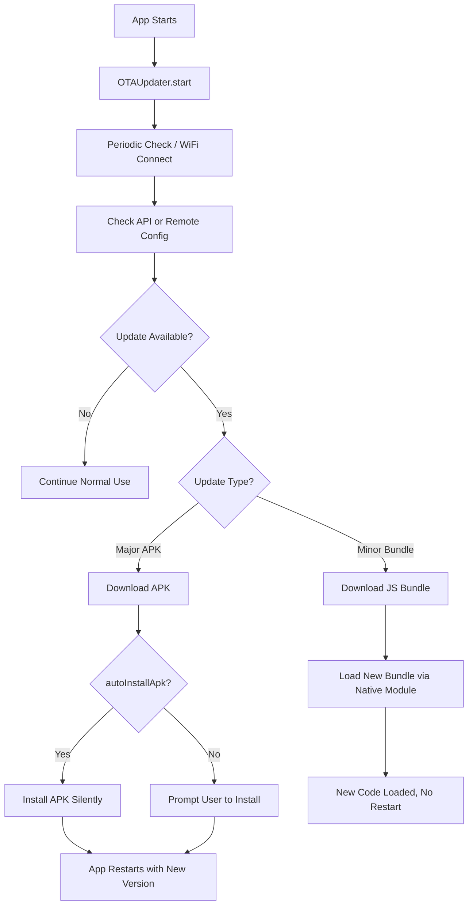

# React Native OTA Updater SDK

A React Native SDK for seamless Over-The-Air (OTA) updates. Supports **major APK updates** and **minor JavaScript bundle updates** with WiFi force-update capabilities. Includes optional **Firebase backend**—no server to maintain.

Compatible with React Native's old architecture and **new architecture (TurboModules)**.

---

## How It Helps You

This SDK lets you push updates to your React Native Android app **without going through the Play Store**. Ideal for:

- **Internal apps** (kiosks, field devices, enterprise)
- **Quick bug fixes** between store releases
- **Beta testing** before publishing
- **Apps distributed outside the Play Store**



---

## Complete Feature Overview

| Feature | Description |
|--------|-------------|
| **Major Updates (APK)** | Full app update. Downloads APK, installs automatically (configurable). |
| **Minor Updates (Bundle)** | JavaScript bundle only. Native module loads new bundle without full restart. |
| **Two Backend Options** | Custom REST API or Firebase (Storage + Remote Config + Cloud Functions). |
| **Firebase OTA** | Upload APK to Storage → Cloud Function updates Remote Config → App reads config. No server needed. |
| **WiFi Force Update** | When on WiFi, automatically check, download, and install updates. |
| **Auto-Install APK** | APK installs immediately after download (can disable for user prompt). |
| **Progress Tracking** | Real-time download progress callbacks. |
| **New Architecture** | Supports React Native TurboModules. |

---

## Architecture: Two Ways to Run OTA

### Option A: Custom Backend (Full Control)



**Use when:** You have your own API (Node/Express, etc.) and want full control.

---

### Option B: Firebase (No Server to Maintain)



**Use when:** You want zero server maintenance. Upload APK → Function updates config → App reads config. See [functions/README.md](./functions/README.md) for setup.

---

## In-App Update Flow



---

## Installation

```bash
npm install react-native-ota-sdk
# or
yarn add react-native-ota-sdk
```

### Native Dependencies

```bash
npm install react-native-fs @react-native-community/netinfo react-native-install-apk
```

The native Android module auto-links. See [ANDROID_SETUP.md](./ANDROID_SETUP.md) if needed.

### Android Setup

Add to `android/app/src/main/AndroidManifest.xml`:

```xml
<uses-permission android:name="android.permission.INTERNET" />
<uses-permission android:name="android.permission.WRITE_EXTERNAL_STORAGE" />
<uses-permission android:name="android.permission.READ_EXTERNAL_STORAGE" />
<uses-permission android:name="android.permission.REQUEST_INSTALL_PACKAGES" />
```

Add to `android/app/build.gradle`:

```gradle
android {
    compileOptions {
        sourceCompatibility JavaVersion.VERSION_1_8
        targetCompatibility JavaVersion.VERSION_1_8
    }
}
```

---

## Usage

### Basic Setup (Custom API)

```javascript
import React, { useEffect } from 'react';
import { OTAUpdater } from 'react-native-ota-sdk';

function App() {
  useEffect(() => {
    const updater = new OTAUpdater({
      apiUrl: 'https://your-server.com/api',
      appId: 'com.example.myapp',
      apiKey: 'your-api-key',
      currentVersionName: '1.0.0',
      currentVersionCode: 1,
      forceUpdateOnWifi: true,
      autoDownloadOnWifi: true,
      checkInterval: 3600000,
      onUpdateAvailable: (update) => console.log('Update:', update.versionName),
      onUpdateProgress: (progress) => console.log(`${progress.progress}%`),
      onUpdateComplete: (update) => console.log('Done:', update.versionName),
      onUpdateError: (error) => console.error(error),
    });

    updater.start();
    return () => updater.stop();
  }, []);

  return (/* Your app */);
}
```

### Firebase Backend Setup

1. Configure `firebase.json` in your app root:

```json
{
  "functions": {
    "source": "node_modules/react-native-ota-sdk/functions"
  }
}
```

2. Install and deploy:

```bash
cd node_modules/react-native-ota-sdk/functions
npm install
firebase deploy --only functions
```

3. Use `@react-native-firebase/remote-config` in your app to read `min_version`, `latest_version`, `apk_url`, `update_message`.  
   See [functions/README.md](./functions/README.md) for full setup and IAM permissions.

---

## Configuration Options

| Option | Type | Default | Description |
|--------|------|---------|-------------|
| `apiUrl` | string | required | Backend API URL |
| `appId` | string | required | App identifier |
| `apiKey` | string | optional | API key for auth |
| `currentVersionName` | string | required | e.g. "1.0.0" |
| `currentVersionCode` | number | required | e.g. 1 |
| `checkInterval` | number | 3600000 | Check interval (ms) |
| `forceUpdateOnWifi` | boolean | false | Force update when on WiFi |
| `autoDownloadOnWifi` | boolean | false | Auto-download on WiFi |
| `autoInstallApk` | boolean | true | Auto-install APK after download |
| `autoInstallOnWifi` | boolean | false | Only auto-install on WiFi |

---

## Standalone Utilities

### VersionChecker

```javascript
import { VersionChecker } from 'react-native-ota-sdk';

const checker = new VersionChecker({ apiUrl, appId, apiKey });
const result = await checker.checkForUpdates();
if (result.updateAvailable) console.log(result.update);
```

### NetworkMonitor

```javascript
import { NetworkMonitor } from 'react-native-ota-sdk';

const monitor = new NetworkMonitor();
monitor.startMonitoring((isWifi, isConnected) => { /* ... */ });
const isWifi = await monitor.checkWifiAsync();
```

---

## Documentation

| Document | Description |
|----------|-------------|
| [ANDROID_SETUP.md](./ANDROID_SETUP.md) | Native module setup and manual linking |
| [TESTING.md](./TESTING.md) | Testing OTA on Android emulator |
| [functions/README.md](./functions/README.md) | Firebase Cloud Functions setup and deploy |

---

## Troubleshooting

| Issue | Solution |
|-------|----------|
| APK install fails | Grant `REQUEST_INSTALL_PACKAGES`; allow installs from unknown sources |
| Bundle not applying | Ensure native module is linked; check [ANDROID_SETUP.md](./ANDROID_SETUP.md) |
| Update checks fail | Verify `apiUrl`, `appId`, network connectivity |
| Firebase: Remote Config not updating | Add **Firebase Remote Config Admin** and **Storage Object Viewer** to IAM |

---

## License

MIT
