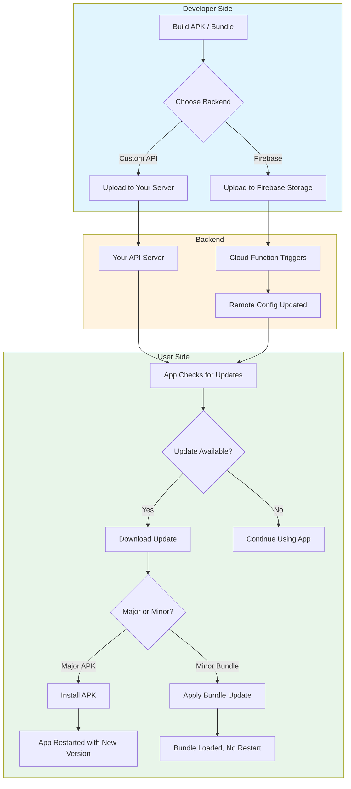
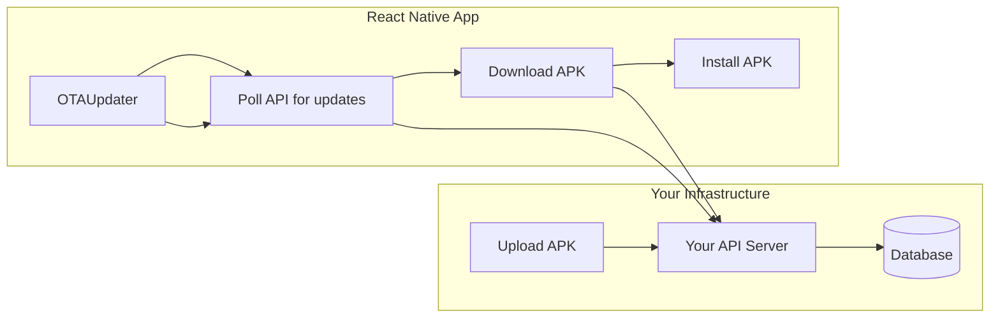
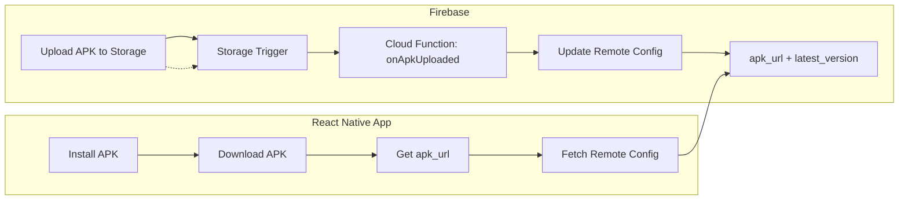
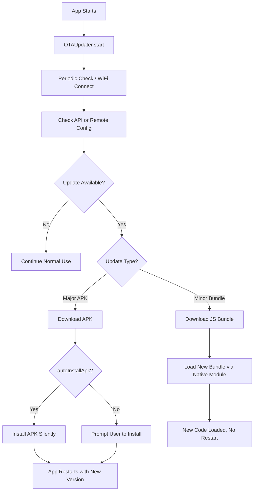

# React Native OTA Updater SDK

A React Native SDK for seamless Over-The-Air (OTA) updates. Supports **major APK updates** and **minor JavaScript bundle updates** with WiFi force-update capabilities. Includes optional **Firebase backend**—no server to maintain.

Compatible with React Native's old architecture and **new architecture (TurboModules)**.

---

## How It Helps You

This SDK lets you push updates to your React Native Android app **without going through the Play Store**. Ideal for:

- **Internal apps** (kiosks, field devices, enterprise)
- **Quick bug fixes** between store releases
- **Beta testing** before publishing
- **Apps distributed outside the Play Store**



---

## Complete Feature Overview

| Feature | Description |
|--------|-------------|
| **Major Updates (APK)** | Full app update. Downloads APK, installs automatically (configurable). |
| **Minor Updates (Bundle)** | JavaScript bundle only. Native module loads new bundle without full restart. |
| **Two Backend Options** | Custom REST API or Firebase (Storage + Remote Config + Cloud Functions). |
| **Firebase OTA** | Upload APK to Storage → Cloud Function updates Remote Config → App reads config. No server needed. |
| **WiFi Force Update** | When on WiFi, automatically check, download, and install updates. |
| **Auto-Install APK** | APK installs immediately after download (can disable for user prompt). |
| **Progress Tracking** | Real-time download progress callbacks. |
| **New Architecture** | Supports React Native TurboModules. |

---

## Architecture: Two Ways to Run OTA

### Option A: Custom Backend (Full Control)



**Use when:** You have your own API (Node/Express, etc.) and want full control.

---

### Option B: Firebase (No Server to Maintain)



**Use when:** You want zero server maintenance. Upload APK → Function updates config → App reads config. See [functions/README.md](./functions/README.md) for setup.

---

## In-App Update Flow



---

## Installation

```bash
npm install react-native-ota-sdk
# or
yarn add react-native-ota-sdk
```

### Native Dependencies

```bash
npm install react-native-fs @react-native-community/netinfo @isudaji/react-native-install-apk
```

The native Android module auto-links. See [ANDROID_SETUP.md](./ANDROID_SETUP.md) if needed.

### Android Setup

Add to `android/app/src/main/AndroidManifest.xml`:

```xml
<uses-permission android:name="android.permission.INTERNET" />
<uses-permission android:name="android.permission.WRITE_EXTERNAL_STORAGE" />
<uses-permission android:name="android.permission.READ_EXTERNAL_STORAGE" />
<uses-permission android:name="android.permission.REQUEST_INSTALL_PACKAGES" />
```

Add to `android/app/build.gradle`:

```gradle
android {
    compileOptions {
        sourceCompatibility JavaVersion.VERSION_1_8
        targetCompatibility JavaVersion.VERSION_1_8
    }
}
```

---

## Usage

### Basic Setup (Custom API)

```javascript
import React, { useEffect } from 'react';
import { OTAUpdater } from 'react-native-ota-sdk';

function App() {
  useEffect(() => {
    const updater = new OTAUpdater({
      apiUrl: 'https://your-server.com/api',
      appId: 'com.example.myapp',
      apiKey: 'your-api-key',
      currentVersionName: '1.0.0',
      currentVersionCode: 1,
      forceUpdateOnWifi: true,
      autoDownloadOnWifi: true,
      checkInterval: 3600000,
      onUpdateAvailable: (update) => console.log('Update:', update.versionName),
      onUpdateProgress: (progress) => console.log(`${progress.progress}%`),
      onUpdateComplete: (update) => console.log('Done:', update.versionName),
      onUpdateError: (error) => console.error(error),
    });

    updater.start();
    return () => updater.stop();
  }, []);

  return (/* Your app */);
}
```

### Firebase Backend Setup

1. Configure `firebase.json` in your app root:

```json
{
  "functions": {
    "source": "node_modules/react-native-ota-sdk/functions"
  }
}
```

2. Install and deploy:

```bash
cd node_modules/react-native-ota-sdk/functions
npm install
firebase deploy --only functions
```

3. Use `@react-native-firebase/remote-config` in your app to read `min_version`, `latest_version`, `apk_url`, `update_message`.  
   See [functions/README.md](./functions/README.md) for full setup and IAM permissions.

---

## Configuration Options

| Option | Type | Default | Description |
|--------|------|---------|-------------|
| `apiUrl` | string | required | Backend API URL |
| `appId` | string | required | App identifier |
| `apiKey` | string | optional | API key for auth |
| `currentVersionName` | string | required | e.g. "1.0.0" |
| `currentVersionCode` | number | required | e.g. 1 |
| `checkInterval` | number | 3600000 | Check interval (ms) |
| `forceUpdateOnWifi` | boolean | false | Force update when on WiFi |
| `autoDownloadOnWifi` | boolean | false | Auto-download on WiFi |
| `autoInstallApk` | boolean | true | Auto-install APK after download |
| `autoInstallOnWifi` | boolean | false | Only auto-install on WiFi |

---

## Implementation guide: Firebase + app-driven OTA

This section describes a **recommended pattern** for implementing OTA updates using Firebase Remote Config and this SDK’s native install. Your app owns the update flow; the SDK provides only the native `OTANative.installApk(path)` and (optionally) the Firebase Cloud Function.

### 1. Remote Config as single source of truth

Use Firebase Remote Config with these parameters:

| Parameter        | Type   | Description |
|-----------------|--------|-------------|
| `min_version`   | Number | Users with `versionCode < min_version` are **blocked** (force update). |
| `latest_version`| Number | Current store version. Users with `versionCode < latest_version` see an **optional** update. |
| `apk_url`       | String | Download URL for the APK (e.g. set by Cloud Function on Storage upload). |
| `update_message`| String | Message shown in the update UI. |

**Logic:**

- `currentVersionCode < min_version` → **Force update** (full-screen block, no skip).
- `currentVersionCode < latest_version` → **Optional update** (dismissible modal).
- `currentVersionCode >= latest_version` → Up to date, no prompt.

To force all users to update, set `min_version` equal to `latest_version`.

### 2. Getting current app version

Your app must know its own `versionCode` (integer). Implement a small **native module** (e.g. `AppVersionModule`) that exposes:

- `getVersionCode()` – returns the app’s current `versionCode` (from `PackageManager.getPackageInfo`).
- `getVersionName()` – for display (optional).
- `getVersionCodeFromApk(apkPath)` – reads `versionCode` from an APK file without installing (for validation before install).

Use this when calling your “check for update” logic and when validating the downloaded APK. Replace `your.package` with your app’s package name (e.g. `com.yourapp`).

**JavaScript/TypeScript bridge (e.g. `AppVersionModule.ts`):**

```typescript
import { NativeModules } from 'react-native';

interface AppVersionModuleInterface {
  getVersionCode: () => Promise<number>;
  getVersionName: () => Promise<string>;
  getVersionCodeFromApk: (apkPath: string) => Promise<number>;
}

const { AppVersionModule } = NativeModules;

export default AppVersionModule as AppVersionModuleInterface;
```

**Android: native module (e.g. `android/app/src/main/java/your/package/AppVersionModule.kt`):**

```kotlin
package your.package

import com.facebook.react.bridge.Promise
import com.facebook.react.bridge.ReactApplicationContext
import com.facebook.react.bridge.ReactContextBaseJavaModule
import com.facebook.react.bridge.ReactMethod

class AppVersionModule(reactContext: ReactApplicationContext) : ReactContextBaseJavaModule(reactContext) {

    override fun getName(): String = "AppVersionModule"

    @ReactMethod
    fun getVersionCode(promise: Promise) {
        try {
            val packageInfo = reactApplicationContext.packageManager.getPackageInfo(reactApplicationContext.packageName, 0)
            val versionCode = if (android.os.Build.VERSION.SDK_INT >= android.os.Build.VERSION_CODES.P) {
                packageInfo.longVersionCode.toInt()
            } else {
                @Suppress("DEPRECATION")
                packageInfo.versionCode
            }
            promise.resolve(versionCode)
        } catch (e: Exception) {
            promise.reject("ERROR", "Failed to get version code: ${e.message}")
        }
    }

    @ReactMethod
    fun getVersionName(promise: Promise) {
        try {
            val packageInfo = reactApplicationContext.packageManager.getPackageInfo(reactApplicationContext.packageName, 0)
            promise.resolve(packageInfo.versionName)
        } catch (e: Exception) {
            promise.reject("ERROR", "Failed to get version name: ${e.message}")
        }
    }

    /** Reads versionCode from an APK file without installing. Used to validate before install. */
    @ReactMethod
    fun getVersionCodeFromApk(apkPath: String, promise: Promise) {
        try {
            val path = apkPath.removePrefix("file://")
            val packageInfo = reactApplicationContext.packageManager.getPackageArchiveInfo(path, 0)
                ?: run {
                    promise.reject("ERROR", "Could not read APK: invalid or corrupted file")
                    return
                }
            val versionCode = if (android.os.Build.VERSION.SDK_INT >= android.os.Build.VERSION_CODES.P) {
                packageInfo.longVersionCode.toInt()
            } else {
                @Suppress("DEPRECATION")
                packageInfo.versionCode
            }
            promise.resolve(versionCode)
        } catch (e: Exception) {
            promise.reject("ERROR", "Failed to read APK version: ${e.message}")
        }
    }
}
```

**Android: package registration (e.g. `AppVersionPackage.kt` in the same folder):**

```kotlin
package your.package

import android.view.View
import com.facebook.react.ReactPackage
import com.facebook.react.bridge.NativeModule
import com.facebook.react.bridge.ReactApplicationContext
import com.facebook.react.uimanager.ReactShadowNode
import com.facebook.react.uimanager.ViewManager

class AppVersionPackage : ReactPackage {
    override fun createNativeModules(reactContext: ReactApplicationContext): List<NativeModule> {
        return listOf(AppVersionModule(reactContext))
    }

    override fun createViewManagers(reactContext: ReactApplicationContext): List<ViewManager<View, ReactShadowNode<*>>> {
        return emptyList()
    }
}
```

**Register in `MainApplication`:** In your `MainApplication.kt` (or `.java`), add `AppVersionPackage()` to the packages list, e.g. `add(AppVersionPackage())`.

### 3. Fetching config and deciding force vs optional

On app startup (or when you want to check):

1. Read current `versionCode` from your native module.
2. Fetch and activate Remote Config (`setDefaults`, `fetch`, `activate`).
3. Read `min_version`, `latest_version`, `apk_url`, `update_message`.
4. If `apk_url` is empty or a placeholder (e.g. before the first Cloud Function run), **do not show** update UI.
5. Compare `currentVersionCode` with `min_version` and `latest_version` and decide: force, optional, or up to date.
6. If force → show a **full-screen** “Update required” screen (back disabled). If optional → show a **modal** with “Update” / “Later”.

**Example: version check (no tokens – use your own Firebase config in the app):**

```javascript
// versionCheck.js – compare current version with Remote Config
import AppVersionModule from './AppVersionModule';  // your native module
import { getAppVersionConfig } from './firebaseRemoteConfig';

export async function checkAppUpdate() {
  const currentVersionCode = await AppVersionModule.getVersionCode();
  const config = await getAppVersionConfig();

  if (config.isPlaceholderUrl || !config.apkUrl) {
    return { force: false, optional: false };
  }

  if (currentVersionCode < config.minVersion) {
    return {
      force: true,
      apkUrl: config.apkUrl,
      message: config.message,
      currentVersion: currentVersionCode,
      latestVersion: config.latestVersion,
    };
  }

  if (currentVersionCode < config.latestVersion) {
    return {
      force: false,
      optional: true,
      apkUrl: config.apkUrl,
      message: config.message,
      currentVersion: currentVersionCode,
      latestVersion: config.latestVersion,
    };
  }

  return { force: false, optional: false };
}
```

```javascript
// firebaseRemoteConfig.js – fetch min_version, latest_version, apk_url (no tokens in code)
import remoteConfig from '@react-native-firebase/remote-config';

const PLACEHOLDER_URL = 'https://example.com/placeholder.apk';

export async function getAppVersionConfig() {
  await remoteConfig().setDefaults({
    min_version: 1,
    latest_version: 1,
    apk_url: PLACEHOLDER_URL,
    update_message: 'A new version is available.',
  });
  await remoteConfig().fetch(0);
  await remoteConfig().activate();

  const minVersion = parseInt(remoteConfig().getValue('min_version').asString(), 10) || 1;
  const latestVersion = parseInt(remoteConfig().getValue('latest_version').asString(), 10) || 1;
  const apkUrl = remoteConfig().getValue('apk_url').asString().trim() || PLACEHOLDER_URL;
  const message = remoteConfig().getValue('update_message').asString().trim() || 'A new version is available.';

  const isPlaceholderUrl =
    !apkUrl || apkUrl === PLACEHOLDER_URL || apkUrl.includes('example.com') || apkUrl.includes('placeholder');

  return { minVersion, latestVersion, apkUrl, message, isPlaceholderUrl };
}
```

### 4. Downloading the APK

Download the APK in your app (e.g. with `react-native-blob-util` or similar) to a path the SDK’s FileProvider can read. Recommended:

- Directory: `{CacheDir}/OTA_Updates/`
- File name: e.g. `app-update-{versionName}.apk`

Ensure the directory exists and the download completes (check HTTP 200) before proceeding to install.

### 5. Validating APK version before install (important)

Before calling `OTANative.installApk(filePath)`, **validate** that the downloaded file’s internal `versionCode` matches what you expect (e.g. `latest_version` from Remote Config). This avoids installing a misnamed or wrong build (e.g. `v2.apk` containing `versionCode` 1).

Implement a native method that reads `versionCode` from an APK file without installing it (e.g. `PackageManager.getPackageArchiveInfo(apkPath, 0)` on Android). Expose it as e.g. `getVersionCodeFromApk(apkPath)` from your native module. In JS:

- After download, call `getVersionCodeFromApk(downloadedPath)`.
- Compare the result with the expected version (e.g. `latest_version`). If they differ, **do not install**; show an error and optionally close the modal/screen.

### 6. Download and install flow (outline)

Implement a single function (e.g. `downloadAndInstallApk(apkUrl, versionName, onProgress?, expectedVersionCode?)`) that your force screen and optional modal call. Logic outline:

1. **Platform** – If not Android, return or open `apkUrl` in browser.
2. **Paths** – Use app cache: e.g. `{CacheDir}/OTA_Updates/` and file name `app-update-{versionName}.apk`.
3. **Directory** – Ensure the download directory exists (create if needed).
4. **Existing file** – If the target file already exists, remove it before downloading.
5. **Download** – Use an HTTP client (e.g. `react-native-blob-util`) to GET `apkUrl` and write to the file path. Support an optional progress callback (e.g. 0–100%).
6. **After download** – Check response status (e.g. 200) and that the file exists at the path.
7. **Validate version (if expectedVersionCode provided)** – Call your native `getVersionCodeFromApk(finalPath)`. If the result is not equal to `expectedVersionCode`, return an error and do **not** call install (e.g. “Downloaded APK version does not match expected”). If reading the APK fails, return an error and do not install.
8. **Install** – If `NativeModules.OTANative?.installApk` exists, call `OTANative.installApk(finalPath)` and return success. The system install UI will appear; the promise can resolve when the intent is started.
9. **Fallback** – If the native module is missing or install fails, optionally open `apkUrl` in the browser (`Linking.openURL`) so the user can download and install manually. Return a result that indicates whether in-app install or fallback was used.

Your function can return a small result object, e.g. `{ success, error?, fallbackToBrowser? }`, so the UI can close the modal or show an alert on failure.

**Example: download and install (generic – no real URLs or tokens):**

```javascript
// otaUpdateService.js
import { Platform, Linking, NativeModules } from 'react-native';
import ReactNativeBlobUtil from 'react-native-blob-util';
import AppVersionModule from './AppVersionModule';  // your native module: getVersionCodeFromApk

const { OTANative } = NativeModules;

export async function downloadAndInstallApk(
  apkUrl,
  versionName,
  onProgress,
  expectedVersionCode,
) {
  if (Platform.OS !== 'android') {
    await Linking.openURL(apkUrl);
    return { success: true, fallbackToBrowser: true };
  }

  const { fs } = ReactNativeBlobUtil;
  const downloadDir = `${fs.dirs.CacheDir}/OTA_Updates`;
  const filePath = `${downloadDir}/app-update-${versionName}.apk`;

  if (!(await fs.exists(downloadDir))) await fs.mkdir(downloadDir);
  if (await fs.exists(filePath)) await fs.unlink(filePath);

  const res = await ReactNativeBlobUtil.config({ path: filePath, fileCache: false })
    .fetch('GET', apkUrl, {});
  if (res.respInfo?.status !== 200) throw new Error(`Download failed: ${res.respInfo?.status}`);
  const finalPath = res.path();
  if (!(await fs.exists(finalPath))) throw new Error('File not found after download');

  onProgress?.(100);

  if (expectedVersionCode != null && AppVersionModule?.getVersionCodeFromApk) {
    const apkVersionCode = await AppVersionModule.getVersionCodeFromApk(finalPath);
    if (apkVersionCode !== expectedVersionCode) {
      return {
        success: false,
        error: `APK version (${apkVersionCode}) does not match expected (${expectedVersionCode}).`,
      };
    }
  }

  if (OTANative?.installApk) {
    await OTANative.installApk(finalPath);
    return { success: true };
  }

  await Linking.openURL(apkUrl);
  return { success: true, fallbackToBrowser: true };
}
```

**Example: app entry – run check and show force or optional UI:**

```javascript
// App.js (or root component)
import { useState, useEffect } from 'react';
import { checkAppUpdate } from './utils/versionCheck';
import ForceUpdateScreen from './components/ForceUpdateScreen';
import OptionalUpdateModal from './components/OptionalUpdateModal';

function App() {
  const [updateResult, setUpdateResult] = useState(null);
  const [checking, setChecking] = useState(true);
  const [optionalModalVisible, setOptionalModalVisible] = useState(false);

  useEffect(() => {
    (async () => {
      const result = await checkAppUpdate();
      setUpdateResult(result);
      setChecking(false);
      if (result.optional) setOptionalModalVisible(true);
    })();
  }, []);

  if (checking) return <LoadingScreen />;
  if (updateResult?.force && updateResult?.apkUrl) {
    return (
      <ForceUpdateScreen
        apkUrl={updateResult.apkUrl}
        message={updateResult.message}
        currentVersion={updateResult.currentVersion}
        latestVersion={updateResult.latestVersion}
      />
    );
  }

  return (
    <>
      <YourMainApp />
      <OptionalUpdateModal
        visible={optionalModalVisible}
        onClose={() => setOptionalModalVisible(false)}
        apkUrl={updateResult?.apkUrl ?? ''}
        message={updateResult?.message ?? ''}
        currentVersion={updateResult?.currentVersion}
        latestVersion={updateResult?.latestVersion}
      />
    </>
  );
}
```

When the user taps “Update” in the force screen or modal, call `downloadAndInstallApk(apkUrl, String(latestVersion), setProgress, latestVersion)` and handle the returned `{ success, error?, fallbackToBrowser? }` (e.g. close modal and show an alert on error).

### 7. Installing via the SDK

Once the file is downloaded and validated:

```javascript
import { NativeModules } from 'react-native';

const { OTANative } = NativeModules;

if (OTANative?.installApk) {
  await OTANative.installApk(finalPath);
  // Install intent started; user completes in system UI
}
```

If `OTANative.installApk` is unavailable, fall back to opening the APK URL in the browser or to a safe fallback of your choice.

The SDK’s Android library provides a **FileProvider** with authority `{applicationId}.ota.fileprovider` and paths that include `cache-path` for `OTA_Updates/`. No need to declare another FileProvider in your app for OTA if you use this path.

### 8. Android setup summary

- **Permissions:** `INTERNET`, `REQUEST_INSTALL_PACKAGES` (and storage if you use external paths).
- **Linking:** Include the SDK’s native module in `settings.gradle` and `app/build.gradle`; add `OTAPackage()` in `MainApplication`.
- **FileProvider:** Merged from the SDK manifest; ensure your download path is under a path covered by the SDK’s `file_provider_paths.xml` (e.g. `CacheDir/OTA_Updates/`).

### 9. Flow summary

```text
App start → Get current versionCode (native)
         → Fetch Remote Config (min_version, latest_version, apk_url)
         → If placeholder apk_url → skip
         → If current < min_version → force screen → Download → Validate APK version → Install via OTANative.installApk
         → If current < latest_version → optional modal → Download → Validate APK version → Install via OTANative.installApk
         → Else → up to date
```

This keeps the logic in your app, uses Remote Config as the single source of truth, and uses the SDK only for the native install and (optionally) the Firebase function that sets `apk_url` and `latest_version`.

---

## Standalone Utilities

### VersionChecker

```javascript
import { VersionChecker } from 'react-native-ota-sdk';

const checker = new VersionChecker({ apiUrl, appId, apiKey });
const result = await checker.checkForUpdates();
if (result.updateAvailable) console.log(result.update);
```

### NetworkMonitor

```javascript
import { NetworkMonitor } from 'react-native-ota-sdk';

const monitor = new NetworkMonitor();
monitor.startMonitoring((isWifi, isConnected) => { /* ... */ });
const isWifi = await monitor.checkWifiAsync();
```

---

## Documentation

| Document | Description |
|----------|-------------|
| [ANDROID_SETUP.md](./ANDROID_SETUP.md) | Native module setup and manual linking |
| [TESTING.md](./TESTING.md) | Testing OTA on Android emulator |
| [functions/README.md](./functions/README.md) | Firebase Cloud Functions setup and deploy |

---

## Troubleshooting

| Issue | Solution |
|-------|----------|
| APK install fails | Grant `REQUEST_INSTALL_PACKAGES`; allow installs from unknown sources; ensure download path is under FileProvider paths (e.g. `CacheDir/OTA_Updates/`) |
| Downloaded APK version doesn't match expected | Validate before install: read `versionCode` from the APK file (e.g. native `getVersionCodeFromApk`) and compare to Remote Config `latest_version`; do not install if mismatch (see [Implementation guide](#implementation-guide-firebase--app-driven-ota) step 5) |
| Bundle not applying | Ensure native module is linked; check [ANDROID_SETUP.md](./ANDROID_SETUP.md) |
| Update checks fail | Verify `apiUrl`, `appId`, network connectivity; for Firebase, ensure Remote Config parameters exist and are fetched |
| Firebase: Remote Config not updating | Add **Firebase Remote Config Admin** and **Storage Object Viewer** to IAM; ensure Cloud Function is deployed and Storage path matches |

---

## License

MIT
